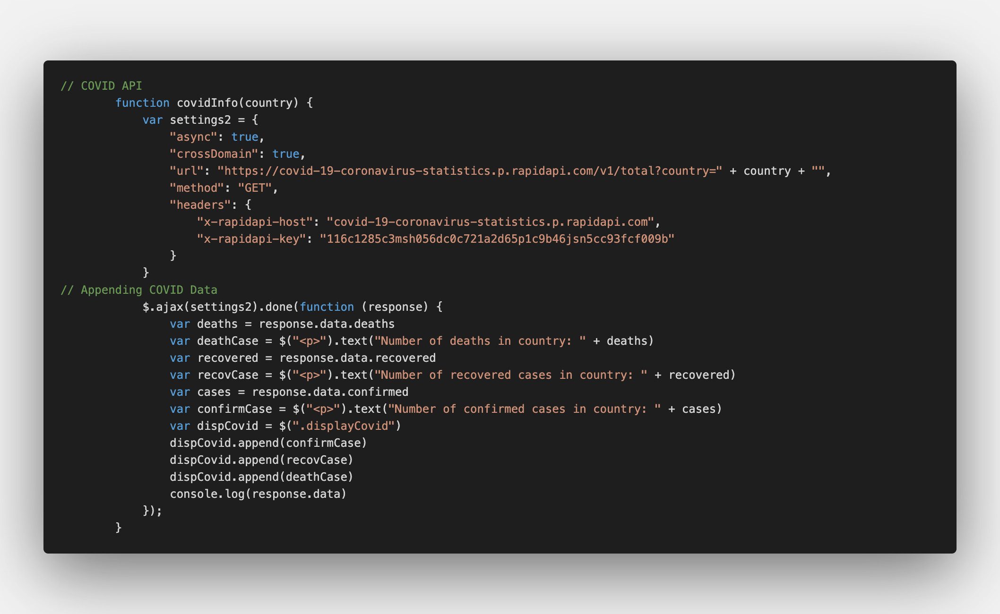
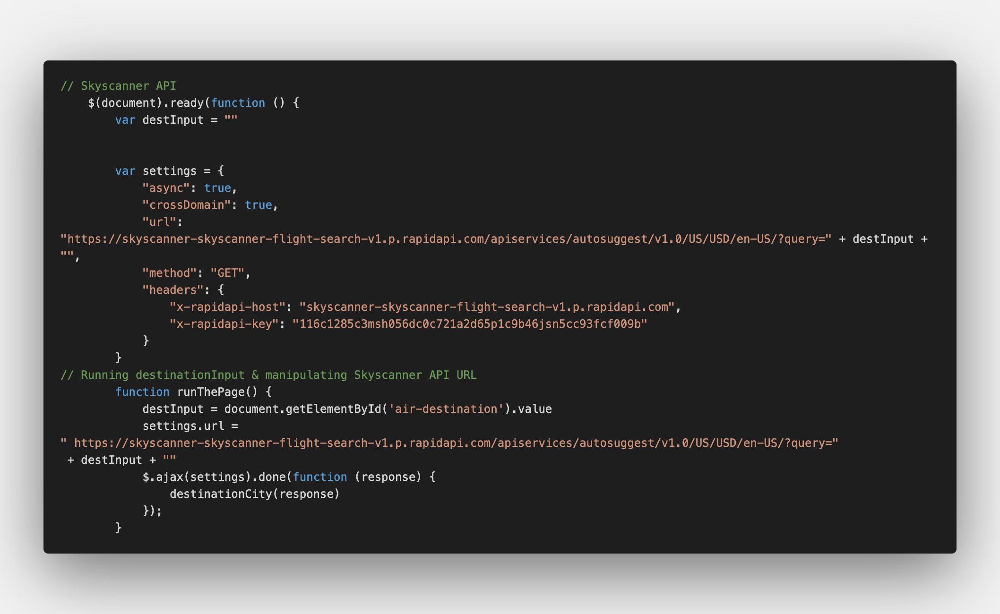

# Fly High

## What is it?

Fly High is a site that allows users to safely plan trips by submitting their destination and receiving relevant airports, current COVID-19 statistics for their destination, and useful information about their destination country.

### Languages Used:
* HTML
* CSS
* JavaScript
* jQuery
* Ajax

### Directions:
1. Enter city name
2. Press button
3. COVID statistics will populate followed by airport locations
4. Refresh the page to search for a new destination

### APIs Used:
* Skyscanner Flight Search (https://rapidapi.com/skyscanner/api/skyscanner-flight-search)
* COVID-19 Statistics (https://rapidapi.com/axisbits-axisbits-default/api/covid-19-statistics)

### Site Layout:

